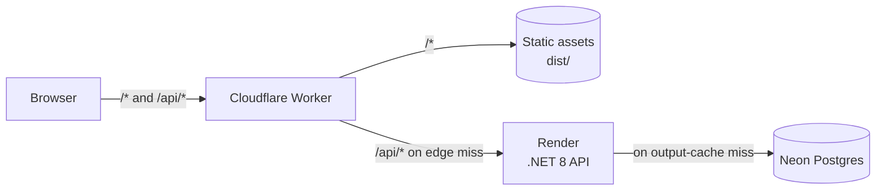

# Architecture

vallabhniturkar.com is a React single-page app and a .NET 8 JSON API, served to
the browser from **one origin** by a Cloudflare Worker.

| Piece | Runs on | Code | Job |
| --- | --- | --- | --- |
| Edge + frontend | Cloudflare Workers | `Portfolio.Web/` | Serves the built SPA; proxies and caches `/api/*` |
| API | Render (Docker web service) | `Portfolio.API/` | Minimal-API endpoints for projects, posts, admin writes |
| Database | Neon serverless Postgres (us-east-1) | EF Core + Npgsql | `Projects` and `Posts` tables |
| DNS | Cloudflare | — | Apex + `www` bound to the Worker |

The browser only talks to the Worker. Page requests are answered from static
assets at the edge; API requests from the edge cache, reaching Render only on a
miss. Because `/api/*` is same-origin there is no CORS preflight, no second DNS
lookup and no second TLS handshake, and the Render URL is never exposed.

## Frontend — `Portfolio.Web/src`

React 19 + TypeScript + Vite, Tailwind 4 with custom `@theme` tokens,
react-router 7, framer-motion, react-markdown for posts.

- **Routing:** every page is `lazy()`-loaded, so the first load ships only the
  layout and home. Deep links work on refresh via the Worker's SPA fallback.
- **Data:** `lib/api.ts` is a typed client over four GET endpoints with relative
  URLs. `hooks/useFetch.ts` + `lib/cache.ts` implement stale-while-revalidate:
  paint cached data (in-memory `Map`, then `sessionStorage`, 10-min max age)
  immediately, refetch in the background, and keep good data if the refetch fails.
- **Admin (`/admin`):** key held in `sessionStorage`, sent as `X-Admin-Key` to
  `/api/admin/posts/`; `clearCache()` after every write.
- **Bundle:** React/router in a long-lived `react` chunk; lowlight's 38 bundled
  grammars (~190 KB) aliased to a shim so only registered languages ship.
- **Dev:** Vite on 5173 proxies `/api` to `http://localhost:5227`.

## Edge — `Portfolio.Web/worker/index.js`, `wrangler.toml`

| `wrangler.toml` setting | Effect |
| --- | --- |
| `[assets] directory = "./dist"` | Vite output served from the edge |
| `not_found_handling = "single-page-application"` | Unknown paths return `index.html` |
| `run_worker_first = ["/api/*"]` | API paths run the script |
| `API_ORIGIN` | Render service the Worker forwards to |

For `/api/*` the Worker:

1. Sends non-public requests (non-GET, `/api/admin/*`, or any `X-Admin-Key`)
   straight to Render, uncached.
2. Looks up public GETs in `caches.default`, keyed on the origin URL only.
3. On a miss, fetches from Render; caches only 2xx responses, via
   `ctx.waitUntil` so the visitor doesn't wait for the write.
4. Stamps `Cache-Control: public, max-age=60, s-maxage=600, …` and
   `X-Edge-Cache: HIT|MISS`.
5. Returns JSON `502` if Render is unreachable.

## API — `Portfolio.API`

ASP.NET Core 8 minimal APIs in vertical slices (`Features/Projects`,
`Features/Posts`), each owning its entity and endpoint registration.

| Endpoint | Auth | Cache |
| --- | --- | --- |
| `GET /api/projects/`, `/api/projects/{slug}` | Public | Output cache 5 min, tag `content` |
| `GET /api/posts/`, `/api/posts/{slug}` | Public (published only) | Output cache 5 min, tag `content` |
| `GET/POST/PUT/DELETE /api/admin/posts/…` | `X-Admin-Key` | Writes evict tag `content` |
| `GET /health` | Public | None — never touches the DB |

Pipeline order: exception handler (ProblemDetails) → Serilog request logging →
Swagger + HTTPS redirect (dev only; Render terminates TLS) → CORS (dev origin) →
Cache-Control stamp for public 200 GETs → output cache → endpoints.

- **Admin auth:** `AdminKeyFilter` compares the header to `Admin:Key` in constant
  time; returns `503` when the key is unset (fail-closed).
- **Reads:** `AsNoTracking()`; the post list projects to `PostListItem` so bodies
  aren't sent to the index page.
- **Container:** two-stage Dockerfile (SDK → `aspnet:8.0`), non-root `app` user,
  port 8080, build context = repo root.

## Data — Neon Postgres

| Table | Notes | Written by |
| --- | --- | --- |
| `Projects` | Unique `Slug`; `TechStack` as `text[]` | `DbSeeder` only |
| `Posts` | Unique `Slug`; index on `PublishedAt` (null = draft); markdown `Content` | `/admin`; seeder only if empty |

Migrations and seeding run only when `RunMigrationsOnStartup=true`, keeping cold
boots fast. Projects are **synced** from `Data/DbSeeder.cs` (upsert by slug,
delete missing), so code is their source of truth. Posts are **seeded once**,
never overwritten.

## Caching

| Layer | Lifetime | Scope | Invalidated by |
| --- | --- | --- | --- |
| Browser app cache (`cache.ts`) | Session, 10-min max age | One tab | Background revalidation; `clearCache()` on admin write |
| Browser HTTP cache | `max-age=60` | One visitor | Expiry |
| Cloudflare edge (`caches.default`) | `s-maxage=600` | One data centre | Expiry or dashboard purge |
| API output cache | 5 min | One API instance | Admin write (tag eviction), expiry, restart |

After an admin edit the API is fresh immediately, but edge copies can be up to
10 minutes old — purge in Cloudflare for an instant update.

## Deployment

A push to `master` triggers three independent pipelines:

| Pipeline | Does |
| --- | --- |
| GitHub Actions (`.github/workflows/ci.yml`) | .NET build + test; web lint + build. Deploys nothing. |
| Cloudflare Workers Builds | Root `Portfolio.Web`: `npm ci && npm run build`, then `npx wrangler deploy` |
| Render | Docker build of `Portfolio.API/Dockerfile`; health check `/health` |

Secrets live only in Render's environment (`ConnectionStrings__Default`,
`Admin__Key`). See `DEPLOY.md` for setup steps.
